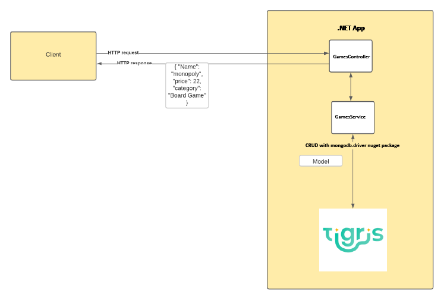

# Tigris MongoDB compatibility and .NET example

## Introduction

Welcome to this Tigris MongoDB compatibility and .NET example app. This repo aims to give you a working example of how you can use the power of Tigris MongoDB compatibility with .NET to create modern web applications.

This repository is a fork of the [MongoDB .NET example](https://github.com/mongodb-developer/mongodb-dotnet-example) repo with some README updates and a minor configuration change required to use the sample with Tigris.

## Prerequisites

- [.NET 7.0](https://dotnet.microsoft.com/en-us/)
- A [Tigris Cloud account](https://console.preview.tigrisdata.cloud/signup?utm_source=github&utm_medium=github&utm_campaign=tigris-mongodb-dotnet-example) or you can [self-host Tigris](https://www.tigrisdata.com/docs/concepts/platform/self-host/?utm_source=github&utm_medium=github&utm_campaign=tigris-mongodb-dotnet-example)

## Getting Started

1. Create a project in Tigris.
1. Create an application key, and copy the Project name, Client ID, and Client Secret values.
1. Edit appsettings.json and appsettings.Development.json to add your `{TIGRIS_CLIENT_ID}`, `{TIGRIS_CLIENT_SECRET}`, `{TIGRIS_PROJECT_NAME}`, and `{TIGRIS_COLLECTION_NAME}`.
1. Run the project to allow you access to the endpoints for all CRUD operations.

## Getting to know the code

The below diagram shows the overall architecture of the application and the following sections will explain the code more.

### Controllers

The GamesController.cs class is where the routes/endpoints for the api are defined. 

Each endpoint calls to a method in the GamesService.cs class.

### Services

The GamesService.cs class contains the code that uses the MongoDB.Driver NuGet package to carry out CRUD operations against your Tigris project.

### Models

The Game.cs class acts as a model you can use throughout the project and the properties in it, map to the fields in the document.

GamesDatabaseSettings.cs contains an interface and implementation that maps to the GamesDatabaseSettings section in appsettings.json and appsettings.Development.json. In this application, the connection string is stored here, but normally in production, you would combine this with [user secrets](https://docs.microsoft.com/en-us/aspnet/core/security/app-secrets?view=aspnetcore-5.0&tabs=windows).

### Project Root

At the root of the project is the usual files that come out of the box with an ASP.NET Core Web API project. 

The only file with changes made here is the Startup.cs class. Inside the ConfigureServices method, the appsettings code is pulled in and the Database settings and Games Service are added to dependency injection for use in other classes.

## Running the code

If your IDE supports it, you can go ahead and run the application from inside the IDE.

If you prefer to run it from your terminal/command-line, you can use `dotnet run`.

## More information

If you want more information about [Tigris, the open source alternative to MongoDB Atlas](https://www.tigrisdata.com?utm_source=github&utm_medium=github&utm_campaign=tigris-mongodb-dotnet-example), you can view [the Tigris documentation](https://www.tigris.com/docs/?utm_source=github&utm_medium=github&utm_campaign=tigris-mongodb-dotnet-example).

Get involved with Tigris by [joining the Tigris Discord](https://www.tigrisdata.com/discord/?utm_source=github&utm_medium=github&utm_campaign=tigris-mongodb-dotnet-example)

